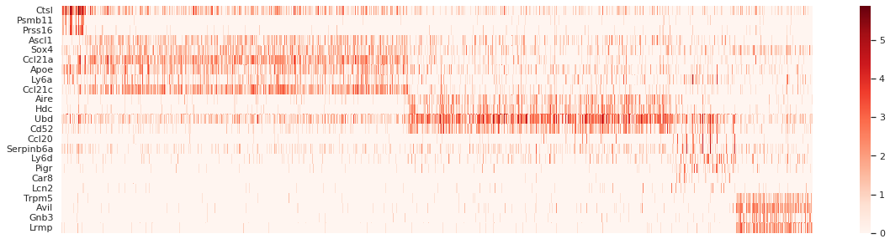

# hse22_hw5
[Работа в colab](https://colab.research.google.com/drive/1F6R6S1Y14ajA1dLZCZgCRufvcWYtiUxo?usp=sharing)
## Нормализация данных 
Transcripts Per Million (TPM) - это метод нормализации для RNA_seq, который следует читать как «на каждые 1 000 000 молекул РНК в образце РНК-секвенции x происходит из этого гена/транскрипта. Обычно имеет формулу:  
  
Ho в нашем случае мы не будем учитывать длину l, поэтому формулой будет риды q делённые на сумму ридов и умноженные на миллион.
## Heatmap
  
По Heatmap'у можно уведеть формирование групп, значит они имеют один тип
## Визуализация UMAC и PCA

  
С помощью anndata и scanpy разбили данные на группы cTEC, mTEC-I, mTEC-II, mTEC-III, mTEC-IV.
